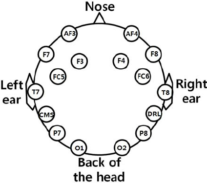

# EEG
I'm going to build and use an EEG machine for abstract and concrete things! Because why not! I'll be following [this guide](https://www.instructables.com/id/DIY-EEG-and-ECG-Circuit). Another [Arduino based one exists too](https://www.instructables.com/id/Mini-Arduino-Portable-EEG-Brain-Wave-Monitor-/)

## Shopping list and price
Mostly from Digikey and Amazon:
* 1x Instrumentation Amplifier (AD620AN): [Digikey, $11.26](https://www.digikey.com/product-detail/en/AD620ANZ/AD620ANZ-ND/750967), [Amazon, £13.02](https://www.amazon.co.uk/INSTR-130DB-AD620ANZ-ANALOG-DEVICES/dp/B007CHIODY/ref=sr_1_1?dchild=1&keywords=AD620ANZ&qid=1599005216&sr=8-1)
* 2x Quad Op-Amp (TL084CN): [Digikey, 2x $0.55](https://www.digikey.com/product-detail/en/TL084CN/296-1784-5-ND/277429)
* Capacitors: Various outlets. Asking someone savvy for best practice here. (£5-£20??)
    - 1x 10 nF, ceramic
    - 1x 20 nF, ceramic
    - 1x 100nF, tantalum
    - 5x 220nF, tantalum
    - 1x 1uF, electrolytic
    - 2x 10uF, electrolytic
* Resistor kit: [This one is recommended (~$10)](https://www.amazon.com/Joe-Knows-Electronics-Value-Resistor/dp/B003UC4FSS/ref=sr_1_1?s=toys-and-games&ie=UTF8&qid=1340397296&sr=1-1)
    - 2x 12Ω
    - 1x 220Ω
    - 1x 560Ω
    - 2x 22kΩ
    - 1x 47kΩ
    - 2x 100kΩ
    - 2x 180kΩ
    - 1x 220kΩ
    - 2x 270kΩ
    - 1x 1MΩ
* 1x 1kΩ Potentiometer: [Digikey, $1.02](https://www.digikey.com/product-detail/en/3362P-1-102LF/3362P-102LF-ND/1088411)
* 1x Breadboard: [Amazon, $6.99](https://www.amazon.com/microtivity-400-point-Experiment-Breadboard-Jumper/dp/B004RXKWDQ/ref=sr_1_3?ie=UTF8&qid=1340398203&sr=8-3&keywords=breadboard)
* Wire kit: [This one is recommended, $15](https://www.amazon.com/Elenco-Piece-Pre-formed-Jumper-Wire/dp/B0002H7AIG/ref=sr_1_1?s=toys-and-games&ie=UTF8&qid=1340398467&sr=1-1&keywords=jumper+wire+set)
* ~~3.5mm audio jack~~
* 2x 9v battery, ~£4
* Electrode gel [Amazon, ~$5](https://www.amazon.com/Parker-Spectra-Electrode-Gram-Tube/dp/B0002CA8RQ/ref=sr_1_1?ie=UTF8&qid=1340913387&sr=8-1&keywords=spectra+360+electrode+gel)
* Electrode cups: [Ambu neuroline recommended, ~$16 for 10](https://www.cnsac-medshop.com/product/ambu-neuroline-cup-electrode-100-cm-lead-wire-10-pcs-pack/)
* Electrode cap or bandana: (Free-£30)
* Electric tape: £1

**Total: £48 + Costs for: Capacitors, Reistors, Wires and cap**
