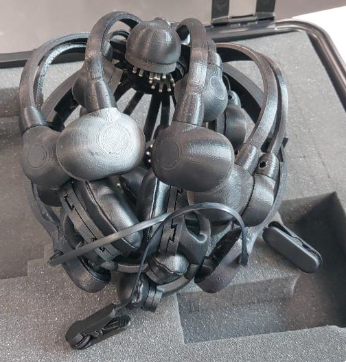

# EEG Headset Quotes
Compilation of quotes/recommendations for EEG headsets I've found:

## What We Have
Firstly, what options we have already in the department to try before the purchase/use instead

### We Have A Wireless EEG in the Dept
After Nik graduated (yay) Toby kind of kept her headset. It's a 20 channel dry wireless headset, (The CGX 20, theres no link to it anymore). Will took a picture of it for me cos he's a sweetheart.

A newer 20 channel versions is here: [CGX Quick-20r](https://www.cgxsystems.com/quick-20r). I can't easily find prices for this headset or these models, you contact and get quoted for them, but I can infer they are very expensive indeed.

### Durhams EEG Lab
Sarah is sending me a link to where we can sign up to use the Uni's EEG headsets. Psychology currently use [Emotiv headsets](https://www.emotiv.com/) (Sarah can't remember the specific make). They use eye tracking alongside built into the headset, and apart from the cost, Sarah says those are good headsets. We should try these out first to see if you like them, and try the one in the department to compare.

## General Points
- (RANT) I cannot believe the markup on some of these fucking products. I understand wanting to make a profit, and having a customer base of researchers with this budget in mind. But [$4000 for a 20 channel amplifier with a bit of bluetooth, a connector and a battery](http://www.physio-tech.co.jp/products/cognionics/pdf/cognionics2019.pdf).
- Sarah mentioned that the software licensing for products (including Emotiv the one she uses) is expensive (as you said before). Hundreds of £ yearly, that can be in budget though.
- Sarah further mentioned that **some journals only accept results from certain headsets** (sounds .... interesting). Emotiv ones are currently trusted.

## Reviews
Some reviews to refer back to potentially.
[0] - A paper published in Neuroinform [A Systemic Review of Available Low-Cost EEG Headsets (Used for Drowsiness Detection)](https://www.frontiersin.org/articles/10.3389/fninf.2020.553352/full)

## Emotiv

## Custom Built
See the upper-directory (and consult with me ofc) about how to make an EEG headset with a chosen number of channels yourself on the cheap.

## Background
You may know some of this theory (with Bashar etc..)
